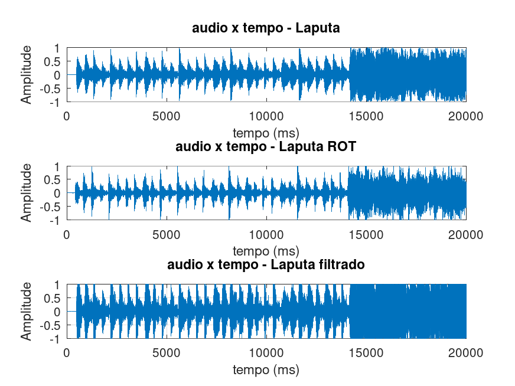
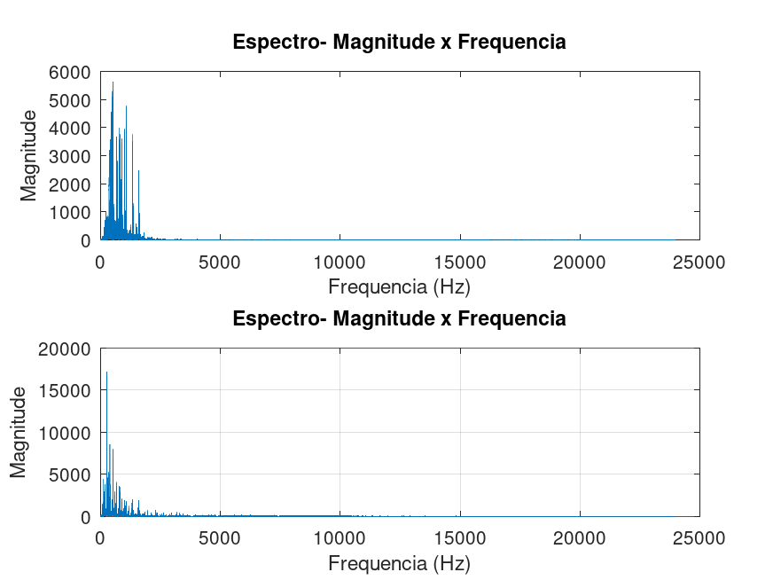
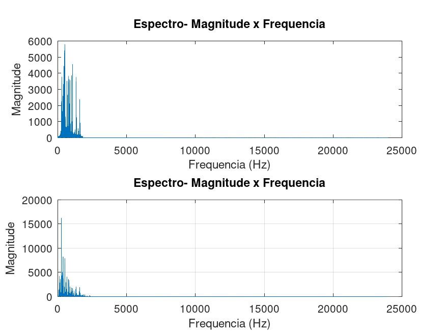

# Audio Denoising using Chebyshev Type I Filter in Octave

This project demonstrates the application of Digital Signal Processing (DSP) techniques to remove noise from an audio signal using a Chebyshev Type I bandpass filter implemented in GNU Octave.

The audio signal used is "Laputa" by Panchiko, provided in both original and noisy versions. The goal of this project is to reduce background noise while preserving vocal and instrumental clarity, particularly in the mid and high-frequency ranges.

## Audio Files

The following audio files are included in the repository and can be played directly on GitHub:

- [Original Audio (20 seconds)](audio/original/laputa_mod.wav)
- [Noisy Audio](audio/noisy/laputa_rot_mod.wav)
- [Filtered Audio](audio/processed/laputa_rot_filtrado.wav)

## Project Overview

### 1. Preprocessing
- The original and noisy audio files were trimmed to the first 20 seconds for analysis.
- The noisy signal was split at 14 seconds:
  - Segment 1 (0–14 s): Instrumental part, filtered with a 6th-order Chebyshev Type I bandpass filter (300–1700 Hz).
  - Segment 2 (14–20 s): Vocal part, filtered with a 4th-order Chebyshev Type I bandpass filter (25–1700 Hz) to preserve high-frequency vocal content.

### 2. Filtering Strategy
| Segment       | Frequency Range (Hz) | Filter Order | Filter Type               |
|---------------|------------------------|--------------|---------------------------|
| 0–14 s        | 300 – 1700            | 6            | Chebyshev Type I (bandpass) |
| 14–20 s       | 25 – 1700             | 4            | Chebyshev Type I (bandpass) |

The Chebyshev Type I filter was chosen for its sharp roll-off in the transition band, allowing effective noise attenuation while maintaining signal integrity in the passband.

### 3. Post-processing
- Filtered segments were concatenated.
- The final signal was normalized and scaled (×1.3) with clipping protection to ensure optimal amplitude.
- All intermediate and final audio files are saved in the `audio/` directory.

## Results

### Time-Domain Comparison


The filtered signal exhibits reduced amplitude peaks and a smoother waveform, indicating effective noise reduction.

### Frequency-Domain Analysis
| Before Filtering | After Filtering |
|------------------|-----------------|
|  |  |

The post-filtering spectra show attenuation of unwanted frequency components outside the passband, confirming the filter's effectiveness.

## How to Run

1. Install [GNU Octave](https://www.gnu.org/software/octave/).
2. Clone this repository:
   ```bash
   git clone https://github.com/pedr0Neves/digital-audio-filtering-octave.git```

3. Open Octave in the project root directory and execute the following scripts in order:
   ```bash
   run('src/preprocess.m');
   run('src/analyze_signals.m');
   run('src/split_and_plot_pre.m');
   run('src/filter_audio.m');
   run('src/concatenate.m');
   run('src/compare_results.m');
   ```
All generated figures are saved in the figs/ folder, and processed audio files are stored in audio/processed/.

## Documentation

- Project Report (PDF) – Full technical report in Portuguese, covering signal selection, filter design, and analysis.

## Authors

- Pedro Emanuel Ferreira Paiva das Neves
- Marcos Antonio Moreira Vieira

Advisor: Carlos Igor Ramos Bandeira

Federal University of Ceará – Quixadá Campus
September 2024

